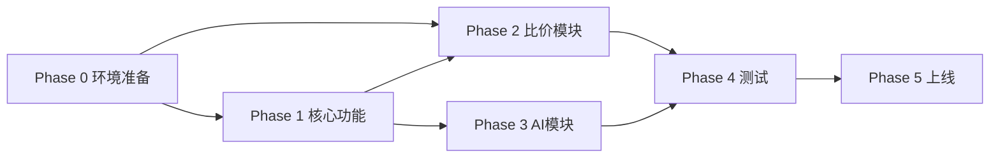

# 项目排期与里程碑

## 10.1 总体时间线（MVP v1.0）

| 阶段 | 周期 | 时间 | 里程碑 |
|------|------|------|--------|
| Phase 0：环境与权限准备 | 1周 | W1 | 全部API账号开通、测试脚本调通 |
| Phase 1：核心功能开发 | 2周 | W2-W3 | 选品算法 + Web看板 + 风险引擎 + 定时任务 |
| Phase 2：比价模块开发 | 1周 | W4 | 1688匹配 + 比价监控 + 预警 |
| Phase 3：AI模块开发 | 1周 | W5 | AI日报生成 + 多模型切换 |
| Phase 4：测试与修复 | 1周 | W6 | 功能测试 + UAT验收 |
| Phase 5：部署上线 | 1-2天 | W6末 | 生产环境部署 + 数据初始化 |

> **缓冲**：每个 Phase 预留约 15% buffer。若某阶段延期超过 buffer，触发范围/排期复盘。

> **关键路径**：Phase 0（1688 企业认证）→ Phase 2（比价依赖 1688）。认证审核是关键路径上的外部依赖，必须 W1 内启动。

## 10.2 阶段依赖关系

> 说明：Phase 2 既依赖 Phase 0 的 1688 鉴权，也依赖 Phase 1 的产品表/选品结果；Phase 3 依赖 Phase 1 的数据聚合能力。

## 10.3 阶段准入/准出标准

| 阶段 | 准入条件 | 准出条件（里程碑达成标准） |
|------|---------|------------------------|
| Phase 0 | 服务器/账号可注册 | 三方 API 测试脚本均调通 |
| Phase 1 | DB schema 定稿 | 选品+看板+风险引擎联调通过 |
| Phase 2 | 1688 鉴权可用、产品表有数据 | 比价+预警联调通过 |
| Phase 3 | 主力 GLM 可用 | 日报自动生成 + 模型切换可用 |
| Phase 4 | 所有功能开发完成 | 0 个 P0、UAT 通过 |
| Phase 5 | UAT 签字 | 生产部署 + 首次数据同步成功 |

## 10.4 详细任务清单

### Phase 0 (W1)：环境与权限准备
| 任务 | 负责角色 | 预估工时 |
|------|---------|---------|
| 注册1688开放平台账号并完成企业认证 | 你 | 2h（+审核等待） |
| 获取 Sorftime API Key | 你 | 1h |
| 获取智谱 AI GLM API Key | 你 | 1h |
| 开发环境搭建（Python/React/Docker） | 开发 | 4h |
| 调通 Sorftime 基础接口测试脚本 | 开发 | 4h |
| 调通 1688 基础接口测试脚本 | 开发 | 4h |
| 调通 GLM 基础接口测试脚本 | 开发 | 2h |
| **里程碑：所有 API Key 就绪，测试脚本通过** | | |

### Phase 1 (W2-W3)：核心功能开发
| 任务 | 负责角色 | 预估工时 |
|------|---------|---------|
| 数据库建表与迁移脚本 | 开发 | 4h |
| 选品算法引擎开发（阈值+评分） | 开发 | 8h |
| Sorftime 每日数据拉取定时任务 | 开发 | 6h |
| 风险规则引擎开发（规则匹配） | 开发 | 6h |
| 看板首页 API（概览数据聚合） | 开发 | 4h |
| 选品中心 API（列表+筛选+排序） | 开发 | 6h |
| 前端框架搭建（React+AntD） | 前端 | 4h |
| 首页看板 UI 开发 | 前端 | 8h |
| 选品中心 UI 开发 | 前端 | 8h |
| 配置中心 UI 开发（阈值+规则） | 前端 | 6h |
| **里程碑：选品算法+看板+风险引擎联调通过** | | |

### Phase 2 (W4)：比价模块开发
| 任务 | 负责角色 | 预估工时 |
|------|---------|---------|
| 标题模糊匹配算法开发 | 开发 | 8h |
| 1688 价格拉取定时任务 | 开发 | 6h |
| 价格变动计算与预警触发 | 开发 | 4h |
| SKU 关联管理界面（前端+后端） | 开发+前端 | 8h |
| 竞品监控页面开发 | 前端 | 6h |
| **里程碑：比价监控+预警联调通过** | | |

### Phase 3 (W5)：AI模块开发
| 任务 | 负责角色 | 预估工时 |
|------|---------|---------|
| AI 统一适配层开发（多模型切换） | 开发 | 6h |
| Prompt 模板设计与优化 | 开发 | 4h |
| 每日 AI 日报生成定时任务 | 开发 | 4h |
| AI 日报展示页面开发 | 前端 | 4h |
| 模型切换配置界面 | 前端 | 2h |
| **里程碑：AI日报自动生成+多模型切换** | | |

### Phase 4 (W6)：测试与修复
| 任务 | 负责角色 | 预估工时 |
|------|---------|---------|
| 单元测试编写与执行 | 开发 | 8h |
| 集成测试（联调所有模块） | 开发 | 4h |
| 功能测试（按测试用例执行） | 测试/你 | 8h |
| Bug 修复 | 开发 | 8h |
| UAT 验收（你亲自使用验证） | 你 | 4h |
| **里程碑：所有 P0 功能验收通过，无阻塞级 Bug** | | |

### Phase 5 (W6末)：部署上线
| 任务 | 负责角色 | 预估工时 |
|------|---------|---------|
| 生产服务器采购与环境配置 | 开发 | 2h |
| Docker 镜像构建与部署 | 开发 | 2h |
| 数据库初始化 | 开发 | 1h |
| 首次数据同步（Sorftime+1688） | 开发 | 1h |
| 上线后监控验证（12小时） | 开发 | 观察 |
| **里程碑：系统正式上线，可正常使用** | | |

## 10.5 风险清单与应对

> 项目级风险的完整评估见 `1.项目立项章程.md` 的 1.4 可行性分析；此处聚焦执行期的可操作风险。

| 风险 | 影响 | 概率 | 应对措施 |
|------|------|------|---------|
| 1688 企业认证审核延迟 | Phase 0 延期，阻塞 Phase 2 | 中 | 提前提交认证（W1 即启动），同时并行其他模块开发 |
| GLM-5.2 API 不稳定 | AI 日报失败 | 低 | 已配置自动切换备用模型 |
| 标题匹配准确率低 | 比价模块失效 | 中 | Phase 2 预留人工确认 UI，匹配后由你审核 |
| Sorftime 免费额度超限 | 测试中断 | 低 | 开发阶段使用 mock 数据，上线后按量付费 |
| 单人开发精力瓶颈 | 全局延期 | 中 | 严格按 P0→P1→P2 交付，砍 P2 保 P0 |