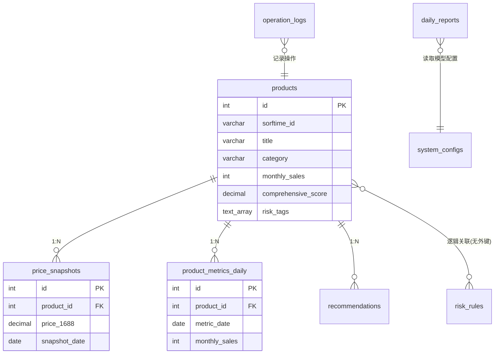

# 数据库设计文档（ER图）

## 4.1 数据库表结构

### 表1：products（产品主表）

```sql
CREATE TABLE products (
    id SERIAL PRIMARY KEY,
    sorftime_id VARCHAR(64) UNIQUE NOT NULL,     -- Sorftime商品唯一ID
    title VARCHAR(500) NOT NULL,                  -- 产品标题
    category VARCHAR(100),                        -- 品类（3D耗材/相纸/墨水等）
    platform VARCHAR(20) DEFAULT 'amazon',        -- 平台（amazon/tiktok）

    -- Sorftime核心字段
    monthly_sales INTEGER,                        -- 月销量
    price NUMERIC(10,2),                          -- 当前售价（USD）
    listing_monopoly DECIMAL(5,2),                -- Listing垄断系数(%)
    brand_monopoly DECIMAL(5,2),                  -- 品牌垄断系数(%)
    seller_monopoly DECIMAL(5,2),                 -- 卖家垄断系数(%)
    review_count INTEGER,                         -- 评论数
    new_product_ratio DECIMAL(5,2),               -- 新品占比(%)
    seller_count INTEGER,                         -- 卖家数量
    amazon_self_ratio DECIMAL(5,2),               -- 亚马逊自营占比(%)

    -- 本地扩展字段
    matched_1688_id VARCHAR(64),                  -- 关联的1688商品ID
    matched_1688_title VARCHAR(500),              -- 1688商品标题
    match_confidence DECIMAL(5,2),                -- 匹配置信度(%)
    match_status VARCHAR(20) DEFAULT 'pending',   -- pending/confirmed/rejected

    -- 风险与评分
    risk_tags TEXT[],                             -- 风险标签数组
    comprehensive_score DECIMAL(5,2),             -- 综合评分
    recommendation_reason TEXT,                   -- 推荐理由

    -- 时间戳与软删除
    data_date DATE NOT NULL,                      -- 数据日期
    created_at TIMESTAMP DEFAULT NOW(),
    updated_at TIMESTAMP DEFAULT NOW(),
    deleted_at TIMESTAMP                          -- 软删除（NULL表示未删除）
);

-- 索引
CREATE INDEX idx_products_category ON products(category);
CREATE INDEX idx_products_data_date ON products(data_date);
CREATE INDEX idx_products_score ON products(comprehensive_score DESC);
CREATE INDEX idx_products_match_status ON products(match_status);
CREATE INDEX idx_products_title_trgm ON products USING gin (title gin_trgm_ops);  -- 标题模糊匹配
```

> 启用扩展：`CREATE EXTENSION IF NOT EXISTS pg_trgm;`（支持 1688 标题模糊匹配）

### 表2：price_snapshots（价格快照表）

```sql
CREATE TABLE price_snapshots (
    id SERIAL PRIMARY KEY,
    product_id INTEGER REFERENCES products(id) ON DELETE CASCADE,

    -- 1688价格信息
    price_1688 NUMERIC(10,2),                     -- 当前1688拿货价(CNY)
    price_1688_previous NUMERIC(10,2),            -- 上次记录价格
    price_change_percent DECIMAL(5,2),            -- 变动百分比
    price_unit VARCHAR(20) DEFAULT 'per_kg',      -- 计价单位

    -- 平台价格信息
    price_platform NUMERIC(10,2),                 -- 平台当前售价(USD)
    price_platform_previous NUMERIC(10,2),        -- 上次记录售价

    -- 预估利润
    estimated_profit NUMERIC(10,2),               -- 预估利润(USD)
    profit_margin DECIMAL(5,2),                   -- 利润率(%)

    snapshot_date DATE NOT NULL,
    created_at TIMESTAMP DEFAULT NOW()
);

CREATE INDEX idx_price_snapshots_product_id ON price_snapshots(product_id);
CREATE INDEX idx_price_snapshots_date ON price_snapshots(snapshot_date);
```

### 表3：product_metrics_daily（每日指标表）

> 用于支撑 FR-03「近 7 天销量趋势」。products 表只存最新值，历史趋势由本表承载。

```sql
CREATE TABLE product_metrics_daily (
    id SERIAL PRIMARY KEY,
    product_id INTEGER REFERENCES products(id) ON DELETE CASCADE,
    metric_date DATE NOT NULL,
    monthly_sales INTEGER,                        -- 当日采集的月销量
    price NUMERIC(10,2),
    review_count INTEGER,
    UNIQUE (product_id, metric_date)
);

CREATE INDEX idx_metrics_product_date ON product_metrics_daily(product_id, metric_date DESC);
```

### 表4：daily_reports（每日AI日报表）

```sql
CREATE TABLE daily_reports (
    id SERIAL PRIMARY KEY,
    report_date DATE UNIQUE NOT NULL,

    -- AI生成内容（各模块）
    recommendations TEXT,                         -- 今日推荐
    trend_analysis TEXT,                          -- 趋势解读
    risk_alerts TEXT,                             -- 风险提示
    action_suggestions TEXT,                      -- 行动建议

    -- 元数据
    model_used VARCHAR(50) DEFAULT 'glm-5.2',     -- 使用的模型
    raw_prompt TEXT,                              -- 原始Prompt（调试用，需脱敏）
    generation_time_ms INTEGER,                   -- 生成耗时(毫秒)

    created_at TIMESTAMP DEFAULT NOW(),
    updated_at TIMESTAMP DEFAULT NOW()
);
```

### 表5：recommendations（周度推荐清单）

```sql
CREATE TABLE recommendations (
    id SERIAL PRIMARY KEY,
    product_id INTEGER REFERENCES products(id) ON DELETE CASCADE,
    week_start DATE NOT NULL,

    -- 推荐信息
    rank_position INTEGER,                        -- 排名（1-10）
    reason TEXT,                                  -- 推荐理由
    expected_daily_orders INTEGER,                -- 预估日出单量

    created_at TIMESTAMP DEFAULT NOW()
);

CREATE INDEX idx_recommendations_week ON recommendations(week_start);
CREATE INDEX idx_recommendations_rank ON recommendations(rank_position);
```

### 表6：risk_rules（风险规则配置表）

```sql
CREATE TABLE risk_rules (
    id SERIAL PRIMARY KEY,
    rule_name VARCHAR(100) NOT NULL,
    trigger_conditions JSONB NOT NULL,            -- JSON格式触发条件

    -- 输出
    risk_level VARCHAR(20) DEFAULT 'warning',     -- danger/warning/info
    risk_tag VARCHAR(50),                         -- 风险标签
    alert_message TEXT,                           -- 提示文案
    suggested_action TEXT,                        -- 建议操作

    is_active BOOLEAN DEFAULT TRUE,
    created_by VARCHAR(50),
    created_at TIMESTAMP DEFAULT NOW(),
    updated_at TIMESTAMP DEFAULT NOW()
);

-- 预置规则示例数据
INSERT INTO risk_rules (rule_name, trigger_conditions, risk_level, risk_tag, alert_message) VALUES
('墨水-易燃液体', '{"category": "ink", "type": "oil_based"}', 'danger', '易燃液体', '⛔ 属3类易燃液体，需MSDS+非危鉴定，空运受限'),
('相纸-易损', '{"category": "photo_paper"}', 'warning', '易损易潮', '⚠️ 需三重包装+干燥剂，运输破损率高');
```

### 表7：system_configs（系统配置表）

```sql
CREATE TABLE system_configs (
    id SERIAL PRIMARY KEY,
    config_key VARCHAR(100) UNIQUE NOT NULL,
    config_value JSONB NOT NULL,
    description TEXT,
    updated_at TIMESTAMP DEFAULT NOW()
);

-- 预置配置项
INSERT INTO system_configs (config_key, config_value, description) VALUES
('ai.model_priority', '{"primary":"glm-5.2","backup":["glm-5.1","deepseek","minimax"]}', 'AI模型优先级'),
('algorithm.thresholds', '{"monthly_sales_min":5000,"monthly_sales_max":150000,"listing_monopoly":30}', '选品阈值');
```

### 表8：operation_logs（操作日志表）

```sql
CREATE TABLE operation_logs (
    id SERIAL PRIMARY KEY,
    trace_id VARCHAR(64),                         -- 链路追踪ID
    operation_type VARCHAR(50),                   -- data_sync/price_check/ai_generate/config_change
    operator VARCHAR(50) DEFAULT 'system',
    details JSONB,                                -- 注意：不得记录明文API Key
    status VARCHAR(20),                           -- success/failed
    error_message TEXT,
    duration_ms INTEGER,
    created_at TIMESTAMP DEFAULT NOW()
);

CREATE INDEX idx_logs_created_at ON operation_logs(created_at DESC);
CREATE INDEX idx_logs_trace_id ON operation_logs(trace_id);
```

## 4.2 ER关系图



## 4.3 数据归档与分区策略

- `price_snapshots`、`product_metrics_daily` 按月分区（pg_partman），保留近 12 个月明细，更早的按月聚合后归档至 `*_archive` 表。
- `products` 为当前快照表，不保留多版本历史（历史由 `product_metrics_daily` 承载）。
- `operation_logs` 保留 90 天，超期转冷存储。